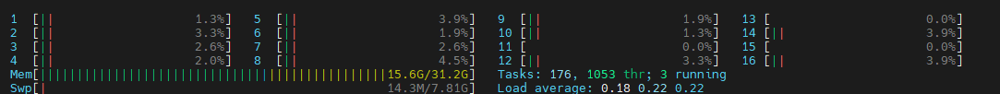

<head><title></title><meta charset="utf-8"><link rel="stylesheet" href="./styles.css"></head><body class="light-theme blue_sky" style="padding: 20px;">
<h1 style="text-align: center;">Optimize Minecraft Server</h1><h3 style="text-align: left;">Support</h3>
<ul><li data-checked="true">Papermc </li><li data-checked="true">Purpur</li><li data-checked="true">bukkit</li><li data-checked="true">spigot</li></ul>
 

<h3>Minecraft Version&nbsp;</h3>
 
<pre class="" spellcheck="false">+ Support 1.19 → 1.8 - Unsupport 1.7~</pre>
 
<h1 style="text-align: center;">Performance</h1>
 

 

 
<pre class="" spellcheck="false">CPU : Intel(R) Xeon(R) CPU E5-2630 v3 @ 2.40GHz 8c 16t RAM : 64GB SSD : 1TB Internet : inter 1g/1g DDC : Dell Inc. PowerEdge R730 OS : Linux Centos7</pre>
 

หากอยากได้ Version ไหนติดต่อได้ที่&nbsp;<a href="https://discord.com/invite/hGZ3HxCJER">https://discord.com/invite/hGZ3HxCJER</a>&nbsp;ติดต่อกับ tyxm.n#1979

นี้เป็นเพียง optimize เบื้องต้นเท่านั้น อาจจะไม่ได้ดีมากขึ้นอยู่กับหลายๆปัจจัย หากมีข้องสงใสโปรดติดต่อ tyxm.n#1979 &lt;3
 

</body>
